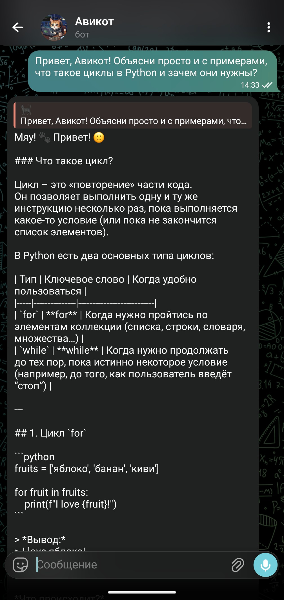
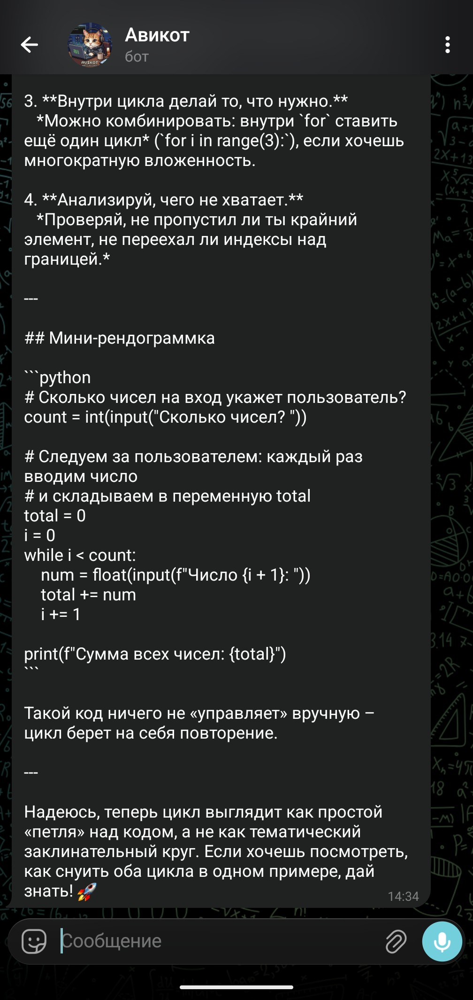

# 🐾 Avikot AI Telegram Bot 

**Авикот** — это интеллектуальный Telegram-бот, созданный на Python. Мой первый проект, успешно перенесенный со смартфона на облачный сервер для работы 24/7.

### 🌟 Что он умеет:
* **Диалоги с ИИ:** Отвечает на вопросы и поддерживает беседу.
* **Облачный хостинг:** Работает на PythonAnywhere, не завися от моего устройства.
* **Живое общение:** Имитирует набор текста (`typing status`).

### 🛠 Технологии:
* **Язык:** Python
* **Библиотеки:** `pyTelegramBotAPI`, `requests`
* **Хостинг:** Linux / PythonAnywhere

### 🎓 Мои достижения в проекте:
* Настроила серверную среду и установку зависимостей через консоль.
* Реализовала логику взаимодействия с внешними API.
* Самостоятельно устранила конфликты запусков (Error 409).
* 
